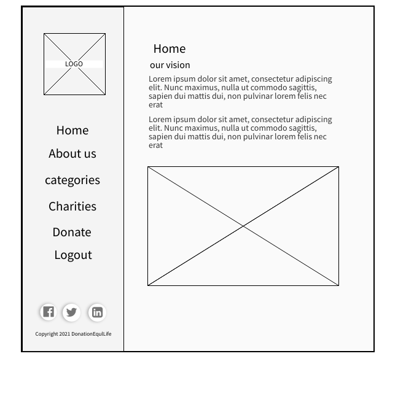
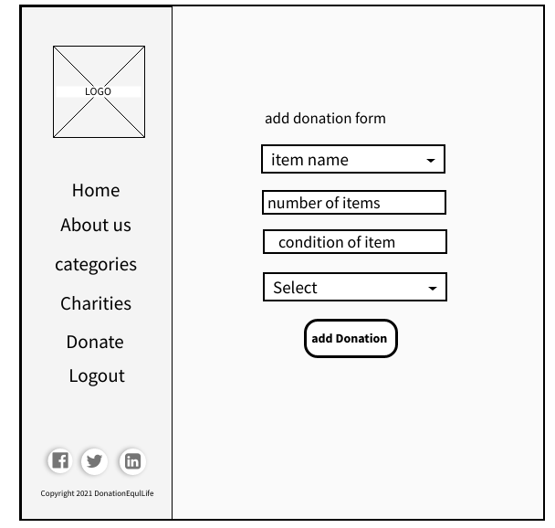
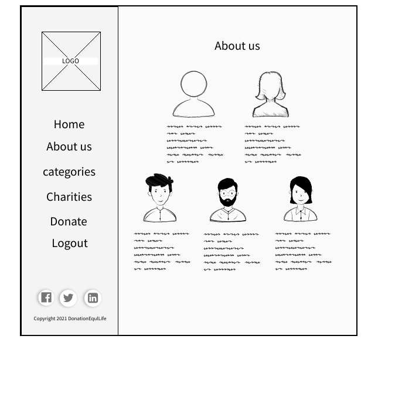
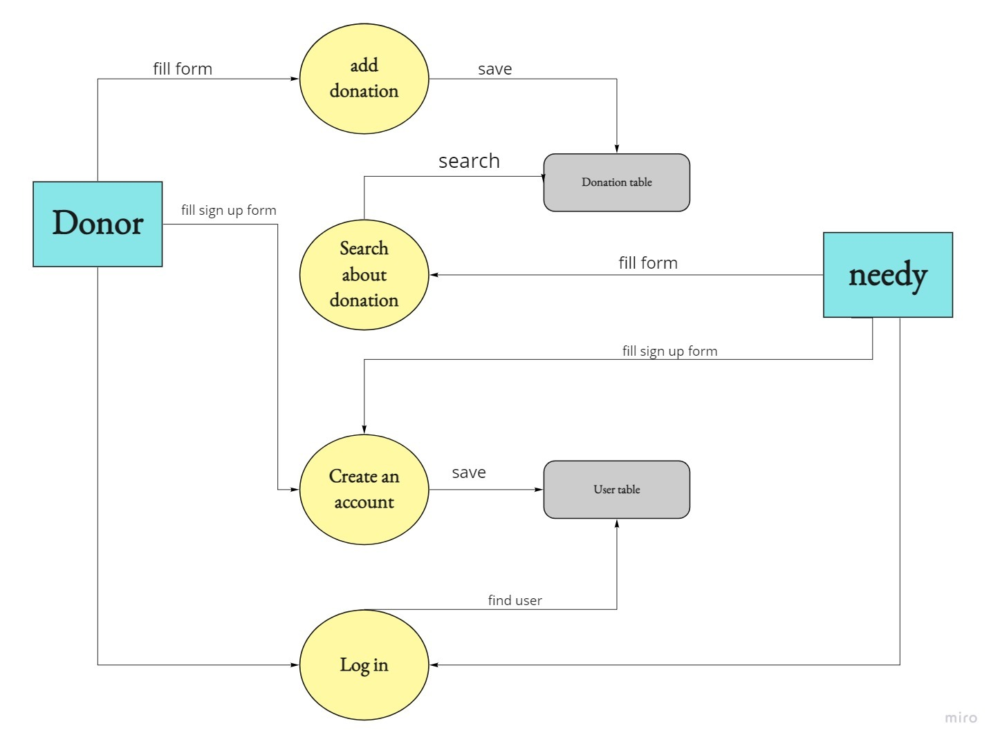

# DonationLife

## Team members

1. Yazan Alkharabsheh
2. Abdurrahman Abuata
3. Hiba Almade
4. obada Hamadneh
5. Tamara Bassam

## Overview

As the percentage of poor people increase in Jordan and those people face difficulty in finding furniture and the tooles for the kitchen so we need an application that find what the poor people need and make the people who want to donate to do this process easily

solution
we design application using (spring boot ) to match between the poor people and the donatiers.

## Wireframes

### The Home Page

### The Donation Page

### The About Us Page

## User Stories

[User Stories Board](https://trello.com/b/IRO3P45I/donation-projectt)

## Software Requirements

[software requirments file](requirements.md)

## Domain Modeling

## Database Schema Diagram

Each user has his own account and permissions

* The admin has the powers to delete, add and modify all data base
* Donor Add items he wants to donate
* The needy can search for what he wants from donations

