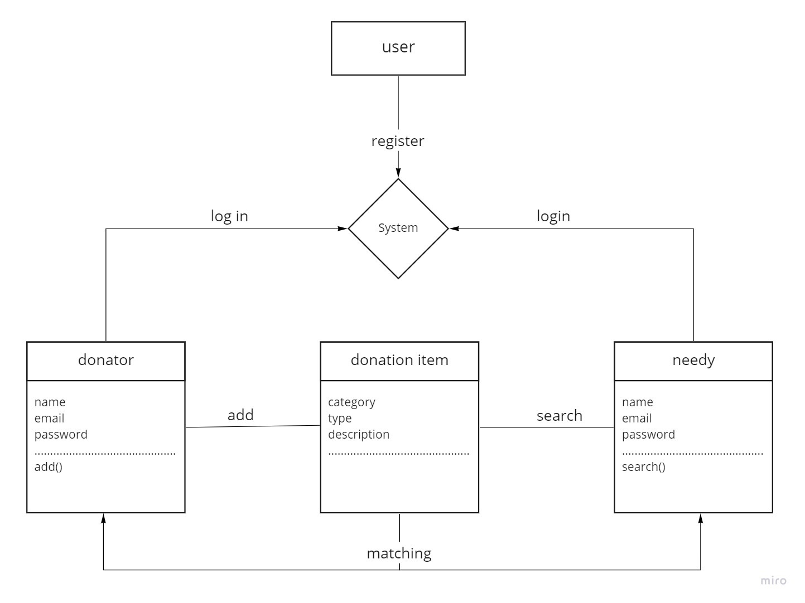

# Software Requirements

## Vision

This product aims to help and serve the community by creating a platform that facilitates the exchange of donations and finding people's needs faster and easier.

### Problem domain

We aim to help and facilitate the way of communication between donors, associations, charities and those in need
By classifying donations and facilitating the search for them
Accelerate communication between all parties

### Importance of this project

What distinguishes our product will be the presence of a direct search and link for something good, there is no need for a long search, which has an impact on improving the communication process

### range (in/out)

#### In - what will your product do

* The user will be able to make an account according to its type as a donor or a needy
* He will be able to add items for donation and they will be added to the list of donations
* The user will be able to search for things he wants
* If a match is found between what was entered by a donor and a needy, they will be informed of this to communicate

#### OUT - What your product won't do

We will not convert this website to ios app
There will be no advertisements for the activities of the associations that deal through our website

### Extended goals

* We will try to add notifications
* We will try to add the possibility of donating money
* We will try to add the ability to donate by ordering delivery
* We will try to add new items that can be donated

### functional requirements

* The admin can add or delete new items
* The admin can delete one of the donations or users
* User can make an account
* User can add a donation
* User can receive donations
* User can view a list of all donations

### Data flow

**As a donor:**
I can create an account as a donor .. I can add something to donate and see a list of everything you donated
And if anyone wants something, I will show it, I will be notified of it

**As a charity or needy:**

I can make an account as a needy.. I can search for something I need, and I will be searched for in the list of donations and notify me if there is one
I can also see a list of all donations

### Non-Functional Requirements

#### Security

We will use the available authorizations and authentication methods to ensure that our user's data are safe and verified, we will be using `Spring Security`, which will manage the site data and will authenticate current users on login.

#### Usability

We will make the website user-friendly as much as we can, by making the navigation easy and designing a rigid structure where every component is smoothly blinding in without any useless additions.
